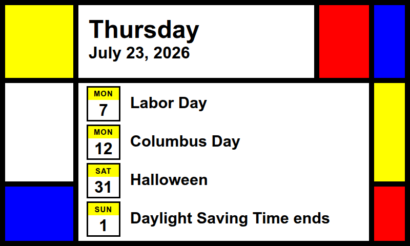

# Mondrian Event Calendar for reTerminal e1002 Color

*I made this with A.I. to have fun because I bought an e1002 and wasn't happy 
with what I could make with the default firmware. I also wanted something that
doesn't need my WiFi. This uses BLE only and no cloud services (except for 
needing an application key from Google Cloud to use the calendar API). I'm happy 
with how it came out.*

This project reads upcoming Google Calendar events, renders an image, and pushes
it to a reTerminal e1002 running OpenDisplay over BLE.



## Prerequisites

1. Python 3.12+
1. uv
1. pex
1. A Google Cloud project with Google Calendar API enabled
1. OAuth Desktop App client JSON from Google Cloud Console
1. User-level systemd available (for daemon mode)

## 0) Flash the OpenDisplay Firmware 

1. Browse to the [OpenDisplay Toolbox](https://opendisplay.org/firmware/toolbox/index.html)
1. Select reTerminal e1002
1. Optionally turn on encryption 
1. Turn on deep sleep and set it for 1 hour
1. Install the firmware over the USB serial cable 

The daemon will wait until it hears from your device and update it. The display
will also wake up when you press any button. You can make sleep for less time if
you have a busy calendar. It will affect battery life. 

## 1) Build

Build the PEX artifact with Make:

```bash
make
```

This creates:

- dist/reterminal-daemon.pex

## 2) Configure Google OAuth Credentials

In Google Cloud Console:

1. Enable Google Calendar API.
2. Create OAuth Client ID for a Desktop app.
3. Download the client JSON file.

Import that JSON into the default credentials location used by this app:

```bash
./dist/reterminal-daemon.pex --import-credentials /path/to/client_secret.json
```

## 3) Install

Copy the sample daemon environment:

```bash
cp systemd/reterminal-daemon.env.example systemd/reterminal-daemon.env
```

Edit the `reterminal-daemon.env` file and include the MAC address of your
device, the encryption key if you have one and the IDs of the calendars you want
to display.

Install the built PEX and user systemd unit with Make:

```bash
make install
```

## 4) First Execution (OAuth Consent)

Run once interactively to complete browser consent and generate token.json:

```bash
~/bin/reterminal-daemon.pex --eink-mac AA:BB:CC:DD:EE:FF
```

After successful consent, token is stored at:

- ~/.cache/reterminal-daemon/token.json

## 5) Run as a User Daemon

Start service:

```bash
systemctl --user start reterminal-daemon.service 
```

Check status:

```bash
systemctl --user status reterminal-daemon.service 
```

Stream logs:

```bash
journalctl --user -f --unit reterminal-daemon.service
```

Stop service:

```bash
systemctl --user stop reterminal-daemon.service 
```

## Useful CLI Options

You can run either the installed PEX or the local dist PEX with the same flags.

```bash
~/bin/reterminal-daemon.pex \
  --credentials ~/.cache/reterminal-daemon/credentials.json \
  --token ~/.cache/reterminal-daemon/token.json \
  --max-results 10 \
  --template /path/to/custom-template.html \
  --output events.png \
  --eink-mac AA:BB:CC:DD:EE:FF \
  --eink-key 00112233445566778899AABBCCDDEEFF
```

You can also generate an image without uploading it to the device:

```bash
~/bin/reterminal-daemon.pex \
  --output events.png \
  --skip-device-upload
```

You can change the HTML template:

```bash
~/bin/reterminal-daemon.pex \
  --template path-to-my-template.html \
  --output events.png \
  --skip-device-upload
```

